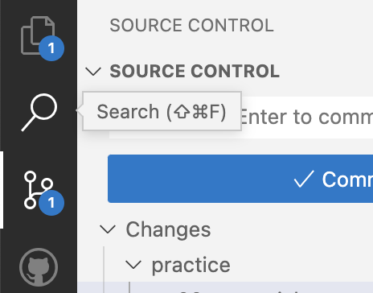
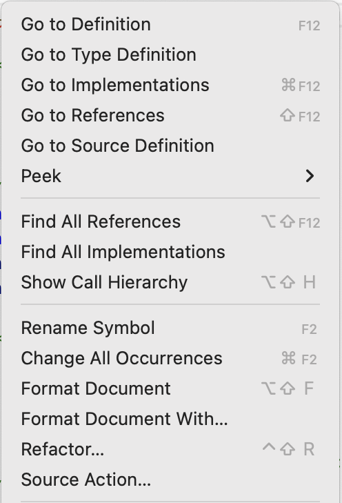
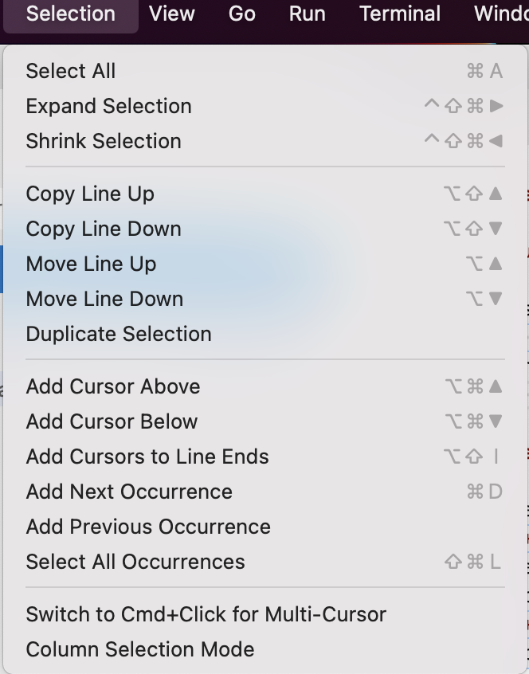

# Life Hacks for Coders

Focusing on VSCode 
 
---

Look for shortcut opportunities when doing easy tasks. They're often written down!

|                      Hover                       |                         Context                         |                      Menu                       |
| :----------------------------------------------: | :-----------------------------------------------------: | :---------------------------------------------: |
|  |  |  |

---

# Mac in General

* Search the toolbar: <kbd>⌘</kbd>+<kbd>?</kbd>
* Typical keyboard shortcuts reference: <kbd>⌘</kbd>+<kbd>/</kbd>
* Uncheck "Rearrange spaces" in "System preferences > Mission control"
* Faster desktop switching  
  <kbd>⌘</kbd>+<kbd>⇥</kbd> or <kbd>⌃</kbd>+<kbd>1/2/...</kbd> 
  (instead of <kbd>⌃</kbd>+<kbd>←/→</kbd> or gesture)
* Edit last message in Slack: <kbd>⌘</kbd>+<kbd>↑</kbd> (or just <kbd>↑</kbd> depending on setting)

---

# VSCode

https://code.visualstudio.com/docs/getstarted/tips-and-tricks  
https://code.visualstudio.com/docs/editor/editingevolved  
https://code.visualstudio.com/shortcuts/keyboard-shortcuts-macos.pdf  
https://keycombiner.com/collections/vscode/

---

# Further thoughts

* Aliases are great - i.e. `oh-my-zsh` plugins:  
  `git push --force-with-lease` becomes `gpf`
* Haven't done, but switch `esc` and `capslock`
